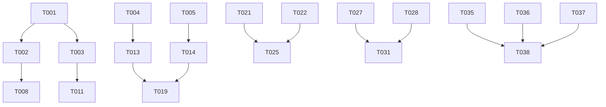

# CMMI Specs Agent 开发任务计划

> **更新时间**: 2025年8月14日  
> **状态**: 活动中  
> **当前阶段**: 核心基础开发阶段  
> **基于**: [完整需求规格说明书](./docs/CMMI_SPECS_AGENT_REQUIREMENTS.md)

## 📊 总体进度概览

| 阶段 | 任务数 | 已完成 | 进行中 | 待开始 | 完成率 |
|------|--------|--------|--------|--------|--------|
| **阶段1 - 核心基础** | 12 | 3 | 2 | 7 | 25% |
| **阶段2 - 智能增强** | 8 | 0 | 0 | 8 | 0% |
| **阶段3 - 文档生成** | 6 | 0 | 0 | 6 | 0% |
| **阶段4 - 质量保证** | 8 | 0 | 0 | 8 | 0% |
| **阶段5 - 发布准备** | 4 | 0 | 0 | 4 | 0% |
| **总计** | 38 | 3 | 2 | 33 | 13% |

## 🚀 阶段1: 核心基础 (目标: 4周)

### T001: MCP 服务器核心实现 【F001】✅
- **状态**: 已完成  
- **描述**: 完整实现 MCP 1.0 协议规范
- **完成时间**: 2025-08-14
- **验收标准**: VS Code 能正常加载 MCP 服务器，所有工具可用

### T002: 8个核心 MCP 工具基础框架 【F002】🔄
- **状态**: 进行中 (60% 完成)
- **描述**: 实现 8 个 MCP 工具的基础框架和统一接口
- **当前进度**:
  - [x] 工具路由和处理器框架
  - [x] 参数验证和错误处理
  - [x] agent_manage 基础功能
  - [ ] task_analyze 智能分析逻辑
  - [ ] workflow_execute 编排执行
  - [ ] intelligent_translate 翻译引擎
  - [ ] config_validate 验证机制
  - [ ] quality_analyze 分析算法
  - [ ] model_schedule 调度策略
  - [ ] system_diagnosis 诊断逻辑

### T003: CLI 工具基础命令 【F003】🔄
- **状态**: 进行中 (40% 完成)
- **描述**: 实现 CLI 工具的基础命令支持
- **当前进度**:
  - [x] help, version, start 命令
  - [x] install-vscode 命令
  - [ ] init <directory> 命令
  - [ ] analyze <directory> 命令
  - [ ] validate 命令
  - [ ] test 命令

### T004: 代理发现引擎完善 【智能核心】✅
- **状态**: 已完成
- **描述**: 增强代理发现引擎，支持依赖分析和智能推荐
- **完成时间**: 2025-08-14
- **验收标准**: 能够智能分析代理依赖关系，提供优化建议

### T005: 工作流编排器基础实现 【智能核心】✅
- **状态**: 已完成
- **描述**: 实现智能工作流编排器基础框架
- **完成时间**: 2025-08-14
- **验收标准**: 支持工作流发现和基础编排执行

### T006: 项目创建引擎实现 【F004】
- **状态**: 待开始
- **描述**: 实现在指定目录创建完整 CMMI 项目结构
- **子任务**:
  - [ ] 标准目录结构创建
  - [ ] 6个标准 CMMI 代理生成
  - [ ] 项目文档模板生成
  - [ ] 构建配置文件生成

### T007: 项目分析功能实现 【F005】
- **状态**: 待开始
- **描述**: 分析现有项目的 CMMI 合规性
- **子任务**:
  - [ ] 代理配置完整性检查
  - [ ] 依赖关系验证
  - [ ] 文档覆盖率分析
  - [ ] 质量度量计算

### T008: 核心组件单元测试 【T001】
- **状态**: 待开始
- **描述**: 为核心组件建立单元测试
- **目标**: 核心组件测试覆盖率 > 80%
- **子任务**:
  - [ ] MCP 服务器测试
  - [ ] 工具处理器测试
  - [ ] 代理发现引擎测试
  - [ ] 工作流编排器测试

### T009: 错误处理机制完善 【R002】
- **状态**: 待开始
- **描述**: 建立完整的错误处理和恢复机制
- **子任务**:
  - [ ] 统一错误处理框架
  - [ ] 智能错误恢复
  - [ ] 用户友好错误提示
  - [ ] 错误日志和监控

### T010: 性能优化基础 【P001】
- **状态**: 待开始
- **描述**: 基础性能优化，确保响应时间达标
- **目标**: MCP 工具响应时间 < 2秒
- **子任务**:
  - [ ] 工具执行性能优化
  - [ ] 内存使用优化
  - [ ] 并发处理优化
  - [ ] 缓存机制实现

### T011: 基础集成测试 【T002】
- **状态**: 待开始
- **描述**: MCP 协议和工具集成测试
- **子任务**:
  - [ ] VS Code 集成测试
  - [ ] MCP 协议兼容性测试
  - [ ] 工具链集成测试
  - [ ] CLI 命令测试

### T012: 基础文档编写
- **状态**: 待开始
- **描述**: 编写核心功能的基础文档
- **子任务**:
  - [ ] API 接口文档
  - [ ] 开发者指南
  - [ ] 部署说明
  - [ ] 故障排除指南

## 🧠 阶段2: 智能增强 (目标: 6周)

### T013: 6个专业 CMMI 代理完整实现 【F006】
- **状态**: 待开始
- **描述**: 完整实现 6个专业 CMMI 代理的所有能力
- **子任务**:
  - [ ] requirements-agent 需求分析能力
  - [ ] design-agent 系统设计能力
  - [ ] coding-agent 开发实现能力
  - [ ] test-agent 测试验证能力
  - [ ] tasks-agent 项目管理能力
  - [ ] spec-agent 流程协调能力

### T014: 智能工作流编排系统 【F009】
- **状态**: 待开始
- **描述**: 完善智能工作流编排的高级功能
- **子任务**:
  - [ ] 依赖关系智能分析
  - [ ] 并行度自动优化
  - [ ] 资源调度算法
  - [ ] 错误恢复策略

### T015: 上下文共享机制 【F010】
- **状态**: 待开始
- **描述**: 实现代理间智能上下文共享
- **子任务**:
  - [ ] 上下文数据模型设计
  - [ ] 共享机制实现
  - [ ] 版本控制和冲突解决
  - [ ] 性能优化

### T016: 任务复杂度智能分析 【task_analyze】
- **状态**: 待开始
- **描述**: 实现任务复杂度的智能分析算法
- **子任务**:
  - [ ] 复杂度评估模型
  - [ ] 代理推荐算法
  - [ ] 工作量估算
  - [ ] 风险识别

### T017: AI 模型调度系统 【model_schedule】
- **状态**: 待开始
- **描述**: 实现智能 AI 模型调度
- **子任务**:
  - [ ] 模型性能监控
  - [ ] 负载均衡算法
  - [ ] 成本优化策略
  - [ ] 故障转移机制

### T018: 系统诊断智能化 【system_diagnosis】
- **状态**: 待开始
- **描述**: 增强系统诊断的智能化水平
- **子任务**:
  - [ ] 智能故障检测
  - [ ] 根因分析
  - [ ] 自动修复建议
  - [ ] 预防性维护

### T019: 代理协作测试
- **状态**: 待开始
- **描述**: 多代理协作场景的完整测试
- **子任务**:
  - [ ] 协作流程测试
  - [ ] 并发执行测试
  - [ ] 错误场景测试
  - [ ] 性能压力测试

### T020: 智能化用户体验
- **状态**: 待开始
- **描述**: 提升用户交互的智能化水平
- **子任务**:
  - [ ] 智能提示和建议
  - [ ] 自适应界面
  - [ ] 个性化配置
  - [ ] 学习用户偏好

## 📝 阶段3: 文档生成 (目标: 4周)

### T021: 多语言文档生成系统 【F007】
- **状态**: 待开始
- **描述**: 实现自动多语言文档生成
- **子任务**:
  - [ ] 文档生成引擎
  - [ ] 多语言模板系统
  - [ ] 格式标准化
  - [ ] 质量验证

### T022: 智能翻译引擎 【intelligent_translate】
- **状态**: 待开始
- **描述**: 技术文档专用智能翻译
- **子任务**:
  - [ ] 术语库建设
  - [ ] 上下文感知翻译
  - [ ] 翻译质量评估
  - [ ] 一致性保证

### T023: CMMI 追溯矩阵生成 【F008】
- **状态**: 待开始
- **描述**: 自动生成和维护需求追溯矩阵
- **子任务**:
  - [ ] 追溯关系建模
  - [ ] 自动关系识别
  - [ ] 矩阵生成算法
  - [ ] 可视化展示

### T024: 文档模板系统
- **状态**: 待开始
- **描述**: 建立可配置的文档模板系统
- **子任务**:
  - [ ] 模板设计语言
  - [ ] 动态内容绑定
  - [ ] 样式和格式控制
  - [ ] 模板继承机制

### T025: 文档质量保证
- **状态**: 待开始
- **描述**: 文档质量的自动检查和保证
- **子任务**:
  - [ ] 内容完整性检查
  - [ ] 格式规范验证
  - [ ] 术语一致性检查
  - [ ] 可读性分析

### T026: API 文档自动生成
- **状态**: 待开始
- **描述**: 从代码自动生成 API 文档
- **子任务**:
  - [ ] 代码注释解析
  - [ ] OpenAPI 规范生成
  - [ ] 交互式文档
  - [ ] 示例代码生成

## 🔍 阶段4: 质量保证 (目标: 3周)

### T027: 完整测试套件建设 【T001-T003】
- **状态**: 待开始
- **描述**: 建立完整的自动化测试套件
- **目标**: 整体测试覆盖率 > 80%
- **子任务**:
  - [ ] 单元测试完善
  - [ ] 集成测试扩展
  - [ ] 端到端测试
  - [ ] 性能测试

### T028: 质量分析系统 【quality_analyze】
- **状态**: 待开始
- **描述**: 实现代码和文档质量综合分析
- **子任务**:
  - [ ] 代码质量度量
  - [ ] 文档质量评估
  - [ ] 安全漏洞扫描
  - [ ] 技术债务分析

### T029: 监控和诊断系统 【M001-M002】
- **状态**: 待开始
- **描述**: 建立完整的监控和诊断体系
- **子任务**:
  - [ ] 业务指标监控
  - [ ] 系统性能监控
  - [ ] 错误日志分析
  - [ ] 告警机制

### T030: 安全加固 【S001-S002】
- **状态**: 待开始
- **描述**: 系统安全性加固
- **子任务**:
  - [ ] 敏感数据保护
  - [ ] 访问控制
  - [ ] 通信加密
  - [ ] 安全审计

### T031: 性能调优 【P001-P002】
- **状态**: 待开始
- **描述**: 系统性能全面优化
- **目标**: 达到所有性能指标要求
- **子任务**:
  - [ ] 响应时间优化
  - [ ] 并发性能优化
  - [ ] 内存优化
  - [ ] 数据库优化

### T032: 兼容性测试
- **状态**: 待开始
- **描述**: 多平台和版本兼容性测试
- **子任务**:
  - [ ] 操作系统兼容性
  - [ ] Node.js 版本兼容性
  - [ ] VS Code 版本兼容性
  - [ ] MCP 协议兼容性

### T033: 压力测试和负载测试
- **状态**: 待开始
- **描述**: 系统在高负载下的稳定性测试
- **子任务**:
  - [ ] 并发用户压力测试
  - [ ] 大数据量处理测试
  - [ ] 长时间运行稳定性测试
  - [ ] 资源泄漏检测

### T034: 回归测试自动化
- **状态**: 待开始
- **描述**: 建立自动化回归测试体系
- **子任务**:
  - [ ] 回归测试用例设计
  - [ ] 自动化执行框架
  - [ ] 测试报告生成
  - [ ] CI/CD 集成

## 🚀 阶段5: 发布准备 (目标: 2周)

### T035: 生产环境部署准备
- **状态**: 待开始
- **描述**: 准备生产环境部署配置
- **子任务**:
  - [ ] 生产配置优化
  - [ ] 环境变量管理
  - [ ] 容器化配置
  - [ ] 部署脚本

### T036: npm 包发布优化
- **状态**: 待开始
- **描述**: 优化 npm 包结构和发布流程
- **子任务**:
  - [ ] 包大小优化
  - [ ] 依赖管理优化
  - [ ] 发布脚本完善
  - [ ] 版本管理策略

### T037: 用户文档完善
- **状态**: 待开始
- **描述**: 完善面向用户的文档
- **子任务**:
  - [ ] 快速入门指南
  - [ ] 完整用户手册
  - [ ] 最佳实践指南
  - [ ] 常见问题解答

### T038: 发布验证和上线
- **状态**: 待开始
- **描述**: 最终发布验证和正式上线
- **子任务**:
  - [ ] 预发布环境验证
  - [ ] 用户验收测试
  - [ ] 性能基准测试
  - [ ] 正式发布上线

## 📈 关键里程碑

| 里程碑 | 目标日期 | 关键交付物 | 验收标准 |
|--------|----------|------------|----------|
| **M1 - 核心功能可用** | 第4周 | MCP服务器 + 8工具基础功能 | VS Code 集成正常，基础功能可用 |
| **M2 - 智能代理协作** | 第10周 | 6代理 + 工作流编排完整 | 多代理协作正常，项目创建可用 |
| **M3 - 文档生成完整** | 第14周 | 多语言文档生成系统 | 文档生成质量符合 CMMI 标准 |
| **M4 - 质量达标** | 第17周 | 完整测试 + 监控系统 | 所有质量指标达标 |
| **M5 - 生产就绪** | 第19周 | 生产发布版本 | 用户验收通过，正式发布 |

## 🔄 任务依赖关系

## 🎯 当前优先级

### 本周重点 (第1周)
1. **T002** - 完成 8个核心 MCP 工具基础框架
2. **T003** - 完成 CLI 工具基础命令实现
3. **T006** - 开始项目创建引擎实现

### 下周计划 (第2周)
1. **T007** - 项目分析功能实现
2. **T008** - 核心组件单元测试
3. **T009** - 错误处理机制完善

### 风险提示
- **T002** 的 task_analyze 和 workflow_execute 是关键路径，需要优先完成
- **T006** 项目创建引擎是用户体验的核心功能
- **T008** 测试覆盖是后续开发的基础，不能推迟太久

---

**注**: 本计划基于[完整需求规格说明书](./docs/CMMI_SPECS_AGENT_REQUIREMENTS.md)制定，任务编号与需求规格中的功能需求对应。
