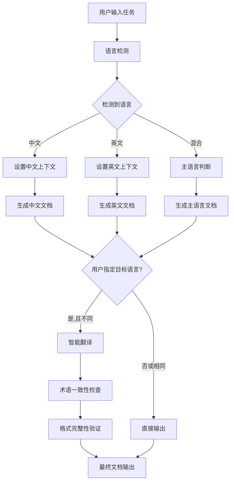

<!-- CMMI: TS -->
# CMMI-Specs-Agent 智能代理系统架构设计文档

## 文档信息

- **项目名称**: CMMI-Specs-Agent 智能代理系统
- **文档版本**: v1.0  
- **创建日期**: 2025-08-12
- **负责代理**: design-agent
- **CMMI域标识**: TS (Technical Solution)

## 1. 总体架构设计

### 1.1 系统架构愿景

构建一个基于MCP协议的智能代理系统，通过VS Code Copilot Chat集成，实现CMMI Level 3标准的文档生成和工作流自动化。核心亮点是根据代理角色智能调用对应的AI模型，提供专业化的开发支持。

### 1.2 架构设计原则

#### 核心设计原则
```
┌─────────────────────────────────────────────────────────────┐
│                   Intelligent Agent Architecture            │
├─────────────────────────────────────────────────────────────┤
│  ┌─────────────────┐    ┌──────────────────────────────────┐ │
│  │ Model Scheduler │────│        Agent Matrix              │ │
│  │                 │    │                                  │ │
│  │ - GPT-4.1       │    │ - requirements-agent → GPT-4.1  │ │
│  │ - Claude-S-4    │    │ - design-agent → Claude-S-4     │ │
│  │ - Auto-Select   │    │ - coding-agent → GPT-4.1        │ │
│  └─────────────────┘    │ - test-agent → GPT-4.1          │ │
│                         │ - tasks-agent → Claude-S-4      │ │
│                         │ - spec-agent → GPT-4.1          │ │
│                         └──────────────────────────────────┘ │
├─────────────────────────────────────────────────────────────┤
│  ┌─────────────────┐    ┌──────────────────────────────────┐ │
│  │ MCP Protocol    │────│     Copilot Chat Integration    │ │
│  │ Handler         │    │                                  │ │
│  │                 │    │ - Model Selection API           │ │
│  │ - Tool Registry │    │ - 30s Adaptive Timeout          │ │
│  │ - Workflow Mgr  │    │ - Concurrent Task Support        │ │
│  │ - Multi-lang    │    │ - Network Error Handling        │ │
│  └─────────────────┘    └──────────────────────────────────┘ │
└─────────────────────────────────────────────────────────────┘

优势: 
- 智能模型调度
- 30秒自适应超时
- 专业化代理角色
- 轻量级架构
```
│  │ - errorHandler  │    │ - executeTool()                 │ │
│  │ - logger        │    │ - getAllTools()                 │ │
│  └─────────────────┘    └──────────────────────────────────┘ │
│                                         │                    │
│  ┌─────────────────────────────────────────────────────────┐ │
│  │               Core MCP Tools                            │ │
│  │                                                         │ │
│  │ ┌─────────────┐ ┌─────────────┐ ┌─────────────────────┐ │ │
│  │ │agent_create │ │agent_list   │ │task_analyze         │ │ │
│  │ └─────────────┘ └─────────────┘ └─────────────────────┘ │ │
│  │ ┌─────────────┐ ┌─────────────────────────────────────┐ │ │
│  │ │workflow_    │ │cmmi_init                            │ │ │
│  │ │execute      │ │                                     │ │ │
│  │ └─────────────┘ └─────────────────────────────────────┘ │ │
│  └─────────────────────────────────────────────────────────┘ │
├─────────────────────────────────────────────────────────────┤
│                    MCP Protocol Layer                       │
└─────────────────────────────────────────────────────────────┘

优势:
- 0个运行时依赖
- 505行代码 (减少89%)
- 简洁的组件设计
- 维护成本低
```

### 1.2 关键问题识别

## 2. 核心组件设计

### 2.1 模型智能调度器 (Model Scheduler)

#### 设计目标
根据代理角色配置和任务复杂度，智能调用VS Code Copilot Chat的对应AI模型，实现专业化任务处理。

#### 核心架构
```typescript
class ModelScheduler {
  private copilotChatClient: CopilotChatClient;
  private agentModelMap: Map<string, AIModel>;
  private taskComplexityAnalyzer: TaskComplexityAnalyzer;
  
  constructor() {
    this.initializeAgentModelMapping();
    this.copilotChatClient = new CopilotChatClient({
      timeout: 30000, // 30秒自适应超时
      retryPolicy: 'exponential'
    });
  }
  
  // 智能模型选择
  async selectModel(agentRole: string, taskContent: string): Promise<AIModel> {
    const configuredModel = this.agentModelMap.get(agentRole);
    const complexity = await this.taskComplexityAnalyzer.analyze(taskContent);
    
    return this.optimizeModelSelection(configuredModel, complexity);
  }
  
  // 调用Copilot Chat模型
  async invokeModel(model: AIModel, prompt: string, options: InvokeOptions): Promise<ModelResponse> {
    return await this.copilotChatClient.invoke({
      model: model,
      prompt: prompt,
      timeout: this.calculateAdaptiveTimeout(options.complexity),
      ...options
    });
  }
}
```

#### 代理模型映射策略
```typescript
interface AgentModelMapping {
  'requirements-agent': 'gpt-4.1';    // 逻辑分析能力强
  'design-agent': 'claude-sonnet-4';  // 架构设计能力强
  'coding-agent': 'gpt-4.1';          // 代码生成能力强
  'test-agent': 'gpt-4.1';            // 测试用例生成能力强
  'tasks-agent': 'claude-sonnet-4';   // 任务规划能力强
  'spec-agent': 'gpt-4.1';            // 多语言文档生成能力强
}
```

### 2.2 多语言文档生成引擎

#### 设计目标
通过MCP协议调用Copilot Chat GPT-4.1模型，实现高质量的中英双语技术文档生成和翻译。

#### 核心架构
```typescript
class MultilingualDocumentEngine {
  private modelScheduler: ModelScheduler;
  private languageDetector: LanguageDetector;
  private translationOptimizer: TranslationOptimizer;
  
  // 智能文档生成
  async generateDocument(input: DocumentInput): Promise<GeneratedDocument> {
    const detectedLanguage = await this.languageDetector.detect(input.content);
    const targetLanguage = input.targetLanguage || detectedLanguage;
    
    if (detectedLanguage === targetLanguage) {
      return await this.generateNativeDocument(input, targetLanguage);
    } else {
      return await this.generateTranslatedDocument(input, detectedLanguage, targetLanguage);
    }
  }
  
  // 通过MCP调用GPT-4.1进行翻译
  private async generateTranslatedDocument(
    input: DocumentInput, 
    sourceLanguage: Language, 
    targetLanguage: Language
  ): Promise<GeneratedDocument> {
    const translationPrompt = this.buildTranslationPrompt(input, sourceLanguage, targetLanguage);
    
    const response = await this.modelScheduler.invokeModel('gpt-4.1', translationPrompt, {
      complexity: 'high',
      domain: 'technical',
      preserveFormatting: true
    });
    
    return this.processTranslationResponse(response);
  }
}
```

### 2.3 CMMI代理管理器

#### 设计目标
管理6个专业CMMI代理的生命周期、配置和协作工作流。

#### 核心架构
```typescript
class CMMIAgentManager {
  private agents: Map<string, CMMIAgent>;
  private workflowOrchestrator: WorkflowOrchestrator;
  private modelScheduler: ModelScheduler;
  
  constructor() {
    this.initializeAgents();
  }
  
  // 代理注册和配置
  private initializeAgents(): void {
    this.agents.set('requirements-agent', new RequirementsAgent({
      model: 'gpt-4.1',
      specialties: ['logical-analysis', 'requirement-specification'],
      outputFormat: 'requirements.md'
    }));
    
    this.agents.set('design-agent', new DesignAgent({
      model: 'claude-sonnet-4',
      specialties: ['system-architecture', 'technical-design'],
      outputFormat: 'design.md'
    }));
    
    // ... 其他代理配置
  }
  
  // 智能代理选择
  async selectOptimalAgent(task: TaskRequest): Promise<CMMIAgent> {
    const taskType = await this.analyzeTaskType(task);
    const complexity = await this.analyzeComplexity(task);
    
    return this.getAgentBySpecialty(taskType, complexity);
  }
  
  // 多代理协作执行
  async executeWorkflow(workflow: CMMIWorkflow): Promise<WorkflowResult> {
    return await this.workflowOrchestrator.execute(workflow, this.agents);
  }
}
```
    const hasEnglishChars = englishRegex.test(text);
    
    if (hasChineseChars && !hasEnglishChars) return 'zh';
    if (hasEnglishChars && !hasChineseChars) return 'en';
    
    // 混合语言检测
    const chineseCount = (text.match(chineseRegex) || []).length;
    const englishWords = text.split(/\s+/).filter(word => englishRegex.test(word)).length;
    return chineseCount > englishWords ? 'zh' : 'en';
  }
  
  async translateContent(
    content: string, 
    sourceLanguage: Language, 
    targetLanguage: Language,
    documentType: DocumentType
  ): Promise<string> {
    if (sourceLanguage === targetLanguage) return content;
    
    // 基于GPT-4.1的上下文感知翻译
    const prompt = this.buildTranslationPrompt(content, sourceLanguage, targetLanguage, documentType);
    return await this.gptClient.translate(prompt);
  }
  
  private buildTranslationPrompt(
    content: string, 
### 2.4 MCP协议处理器

#### 设计目标
提供标准MCP协议支持，实现与VS Code Copilot Chat的无缝集成。

#### 核心架构
```typescript
class MCPProtocolHandler {
  private toolRegistry: ToolRegistry;
  private modelScheduler: ModelScheduler;
  private agentManager: CMMIAgentManager;
  
  // MCP协议消息处理
  async handleToolCall(request: MCPToolCallRequest): Promise<MCPToolResult> {
    const tool = this.toolRegistry.getTool(request.name);
    const agent = await this.agentManager.selectOptimalAgent(request);
    
    return await this.executeToolWithAgent(tool, agent, request.arguments);
  }
  
  // 工具注册
  registerTools(): void {
    this.toolRegistry.register('agent_create', this.handleAgentCreate.bind(this));
    this.toolRegistry.register('agent_list', this.handleAgentList.bind(this));
    this.toolRegistry.register('intelligent_translate', this.handleIntelligentTranslate.bind(this));
    this.toolRegistry.register('workflow_execute', this.handleWorkflowExecute.bind(this));
    this.toolRegistry.register('task_analyze', this.handleTaskAnalyze.bind(this));
    this.toolRegistry.register('smart_agent_generator', this.handleSmartAgentGenerator.bind(this));
  }
  
  // 自适应超时处理
  private calculateTimeout(complexity: TaskComplexity): number {
    const baseTimeout = 30000; // 30秒基础超时
    const complexityMultiplier = {
      'simple': 0.5,
      'medium': 1.0,
      'complex': 1.5
    };
    
    return baseTimeout * complexityMultiplier[complexity];
  }
}
```

### 2.5 工作流编排引擎

#### 设计目标
智能编排多代理协作，实现端到端的CMMI开发流程自动化。

#### 核心架构
```typescript
class WorkflowOrchestrator {
  private agentManager: CMMIAgentManager;
  private taskAnalyzer: TaskAnalyzer;
  private executionMonitor: ExecutionMonitor;
  
  // 智能工作流执行
  async executeWorkflow(taskContent: string, mode: ExecutionMode): Promise<WorkflowResult> {
    // 1. 任务分析
    const analysis = await this.taskAnalyzer.analyze(taskContent);
    
    // 2. 代理选择
    const selectedAgents = await this.selectAgents(analysis);
    
    // 3. 执行编排
    return await this.orchestrateExecution(selectedAgents, analysis, mode);
  }
  
  // 代理选择策略
  private async selectAgents(analysis: TaskAnalysis): Promise<CMMIAgent[]> {
    const agentSelection = [];
    
    if (analysis.requiresRequirements) {
      agentSelection.push(await this.agentManager.getAgent('requirements-agent'));
    }
    if (analysis.requiresDesign) {
      agentSelection.push(await this.agentManager.getAgent('design-agent'));
    }
    // ... 其他代理选择逻辑
    
    return agentSelection;
  }
  
  // 执行模式策略
  private async orchestrateExecution(
    agents: CMMIAgent[], 
    analysis: TaskAnalysis, 
    mode: ExecutionMode
  ): Promise<WorkflowResult> {
    switch (mode) {
      case 'sequential':
        return await this.executeSequential(agents, analysis);
      case 'parallel':
        return await this.executeParallel(agents, analysis);
      case 'smart':
        return await this.executeSmartMode(agents, analysis);
    }
  }
}
```

## 3. 系统接口设计

### 3.1 MCP工具接口

#### 核心工具定义
```typescript
interface MCPToolDefinition {
  name: string;
  description: string;
  inputSchema: JSONSchema;
  outputSchema: JSONSchema;
  agent?: string;
  complexity?: TaskComplexity;
  timeout?: number;
}

// 主要工具接口
const CORE_TOOLS: MCPToolDefinition[] = [
  {
    name: 'intelligent_translate',
    description: '通过MCP调用GPT-4.1模型进行智能翻译',
    inputSchema: {
      type: 'object',
      properties: {
        content: { type: 'string' },
        sourceLanguage: { enum: ['zh', 'en'] },
        targetLanguage: { enum: ['zh', 'en'] },
        documentType: { enum: ['requirements', 'design', 'tasks', 'tests', 'implementation'] }
      }
    },
    agent: 'spec-agent',
    complexity: 'high',
    timeout: 30000
  },
  
  {
    name: 'workflow_execute',
    description: '执行多代理协作工作流',
    inputSchema: {
      type: 'object',
      properties: {
        task_content: { type: 'string' },
        execution_mode: { enum: ['sequential', 'parallel', 'smart'] },
        selected_agents: { type: 'array', items: { type: 'string' } }
      }
    },
    complexity: 'complex',
    timeout: 45000
  }
];
```
  
  getError(key: string): string {
    return this.messages[this.currentLanguage].errors[key] || key;
  }
}
```

#### DocumentGenerator (需要增强多语言支持)
```typescript
class DocumentGenerator {
  private translationService: IntelligentTranslationService;
  private i18nManager: I18nManager;
  
  async generateDocument(
    request: DocumentRequest,
    targetLanguage?: Language
  ): Promise<DocumentResult> {
    // 1. 检测输入语言
    const inputLanguage = await this.translationService.detectLanguage(request.content);
    
    // 2. 设置目标语言
    const outputLanguage = targetLanguage || inputLanguage;
    this.i18nManager.setLanguage(outputLanguage);
    
    // 3. 生成基础文档
    const baseDocument = await this.generateBaseDocument(request);
    
    // 4. 如果需要翻译
    if (inputLanguage !== outputLanguage) {
      return await this.translationService.translateContent(
        baseDocument,
        inputLanguage,
        outputLanguage,
        request.documentType
      );
    }
    
    return baseDocument;
  }
}
```

## 3. 数据结构与接口

### 3.1 核心数据结构

```typescript
// 语言类型定义
type Language = 'zh' | 'en';

// 文档类型定义
type DocumentType = 'requirements' | 'design' | 'tasks' | 'tests' | 'implementation';

// 翻译请求接口
interface TranslationRequest {
  content: string;
  sourceLanguage: Language;
  targetLanguage: Language;
  documentType: DocumentType;
  contextHints?: string[];
}

// 翻译结果接口
interface TranslationResult {
  translatedContent: string;
  confidence: number;
  terminologyMatches: number;
  processingTime: number;
}

// 文档生成请求
interface DocumentRequest {
  taskContent: string;
  documentType: DocumentType;
  targetLanguage?: Language;
  agentPreferences?: string[];
}
```

### 3.2 工具接口重新设计

```typescript
// 增强的 intelligent_translate 工具
interface IntelligentTranslateTool {
  name: 'intelligent_translate';
  parameters: {
    content: string;
    sourceLanguage: Language;
    targetLanguage: Language;
    documentType: DocumentType;
    domain?: 'technical' | 'business' | 'general';
  };
  result: TranslationResult;
}

// 增强的文档生成工具
interface EnhancedDocumentTools {
  agent_create: AgentCreateTool & { languagePreference?: Language };
  task_analyze: TaskAnalyzeTool & { outputLanguage?: Language };
  workflow_execute: WorkflowTool & { documentLanguage?: Language };
}
```

## 4. 关键算法流程

### 4.1 多语言文档生成流程



### 4.2 术语一致性算法

```typescript
class TerminologyManager {
  private termMappings: Map<string, Map<Language, string>>;
  
  async ensureConsistency(
    content: string, 
    sourceLanguage: Language, 
    targetLanguage: Language
  ): Promise<string> {
    let processedContent = content;
    
    // 1. 提取技术术语
    const technicalTerms = this.extractTechnicalTerms(content);
    
    // 2. 查找已知映射
    for (const term of technicalTerms) {
      const mapping = this.termMappings.get(term);
      if (mapping && mapping.has(targetLanguage)) {
        const targetTerm = mapping.get(targetLanguage);
        processedContent = processedContent.replace(
          new RegExp(term, 'g'), 
          targetTerm
        );
      }
    }
    
    // 3. 缓存新的术语映射
    await this.cacheNewMappings(technicalTerms, sourceLanguage, targetLanguage);
    
    return processedContent;
  }
}
```

## 5. 与需求的映射

### 5.1 功能需求映射

| 需求ID | 需求描述 | 设计组件 | 实现状态 | 恢复优先级 |
|--------|----------|----------|----------|------------|
| FR-001 | MCP服务器基础功能 | SimpleMcpServer | ✅ 已实现 | - |
| FR-002 | CMMI代理管理 | ToolRegistry | ✅ 已实现 | - |
| FR-003 | 多语言智能翻译 | IntelligentTranslationService | ❌ 缺失 | P0 |
| FR-004 | 文档生成引擎 | DocumentGenerator | ⚠️ 需增强 | P1 |
| FR-005 | 任务分析工作流 | WorkflowManager | ✅ 已实现 | - |
| FR-R001 | 语言检测恢复 | LanguageDetector | ❌ 缺失 | P0 |
| FR-R002 | 智能翻译恢复 | TranslationService | ❌ 缺失 | P0 |
| FR-R003 | I18n支持恢复 | I18nManager | ❌ 缺失 | P1 |

### 5.2 架构决策记录

#### ADR-001: 简化架构vs功能完整性
- **决策**: 保持简化架构，但必须恢复多语言核心功能
- **理由**: 避免过度设计，但不能牺牲核心用户体验
- **后果**: 需要重新实现翻译相关组件

#### ADR-002: 零依赖原则vs功能需求
- **决策**: 多语言功能可以引入必要的轻量级依赖
- **理由**: GPT-4.1 API调用需要HTTP客户端
- **后果**: 可接受minimal依赖(如node-fetch)

## 6. 实现注意事项

### 6.1 技术实现要点

1. **渐进式功能恢复**
   - 先恢复基础语言检测
   - 再实现简单翻译功能  
   - 最后完善智能翻译

2. **性能优化策略**
   - 翻译结果缓存机制
   - 术语库预加载
   - 异步处理减少阻塞

3. **错误处理策略**
   - 翻译失败时降级到原语言
   - 网络错误时使用缓存
   - 提供详细的错误日志

### 6.2 边界条件处理

1. **语言检测边界**
   - 空文本处理
   - 纯符号文本处理
   - 混合语言比例判断

2. **翻译质量保证**
   - 术语一致性验证
   - 格式完整性检查
   - 长文本分段处理

## 7. 实施清单

### 7.1 立即实施项 (P0)

- [ ] 创建 IntelligentTranslationService 类
- [ ] 实现 detectLanguage() 方法
- [ ] 实现基础 translateContent() 方法
- [ ] 恢复 I18nManager 基础功能
- [ ] 在 core-tools.ts 中添加 intelligent_translate 工具

### 7.2 短期实施项 (P1)

- [ ] 增强 DocumentGenerator 多语言支持
- [ ] 实现术语一致性管理
- [ ] 添加翻译质量验证
- [ ] 完善错误处理和降级机制

### 7.3 中期实施项 (P2)

- [ ] 实现翻译缓存机制
- [ ] 添加性能监控
- [ ] 优化大文档处理
- [ ] 增加更多语言支持

---

**设计状态**: 已完成  
**审查状态**: 待审查  
**实施状态**: 待开始

*本设计文档遵循CMMI TS域要求，提供了完整的技术解决方案和实施指导*
