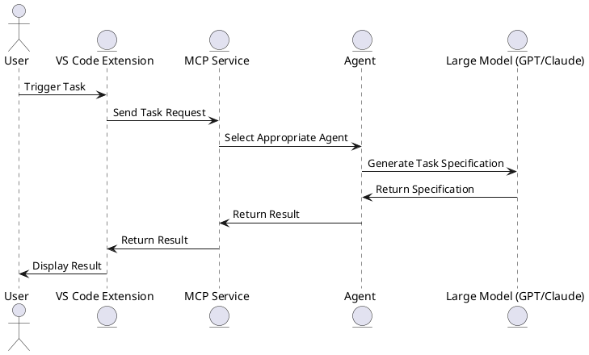

我在其他大模型仔细，说当前方案不可行，前面咨询的时候一直说可行，这是大模型在说谎吗？到底哪个正确 关键限制

单纯 npx CLI 无法直接调用大模型，因为模型运行在 GitHub/VS Code 服务器端，需要插件上下文
在深入分析了 [cmmi-specs-agent](https://github.com/pjy998/cmmi-specs-agent) 项目的结构和功能后，结合 VS Code 扩展插件的开发，我们可以构建一个完整的解决方案，实现 CMMI 任务的自动化生成和执行。以下是该方案的详细分析和架构设计：

---

## 1. cmmi-specs-agent 项目分析

### 1.1 项目结构

该项目主要包含以下目录和文件：

* **agents/**：定义了多个 Agent，用于处理不同类型的任务。
* **configs/**：存放配置文件，定义了任务模板和参数。
* **src/**：核心逻辑实现，包括任务解析、流程控制等。
* **tests/**：单元测试和集成测试。
* **cli.js**：命令行接口，允许用户通过命令行触发任务。
* **install-mcp.sh**：用于安装 MCP（Model Control Protocol）服务的脚本。
* **install-vscode.sh**：用于安装 VS Code 扩展的脚本。

### 1.2 核心功能

* **Agent 调度**：根据任务类型选择合适的 Agent。
* **任务解析**：解析用户输入的任务描述，生成执行计划。
* **流程控制**：根据任务的复杂度，拆分为多个子任务，按顺序执行。
* **日志记录**：记录任务执行的每一步，便于追踪和调试。

---

## 2. VS Code 扩展插件设计

### 2.1 插件功能

* **命令注册**：在 VS Code 中注册命令，用户可以通过命令面板或快捷键触发任务。
* **用户交互**：通过输入框收集用户输入的任务描述。
* **调用 MCP**：通过 HTTP 请求或直接调用 MCP 服务，触发任务执行。
* **显示结果**：在输出面板或 WebView 中显示任务执行的结果。
* **日志记录**：将任务执行的日志输出到输出面板，便于查看和调试。

### 2.2 插件架构

* **命令注册**：使用 `vscode.commands.registerCommand` 注册命令。
* **用户输入**：使用 `vscode.window.showInputBox` 获取用户输入。
* **调用 MCP**：使用 `fetch` 或 `axios` 发送 HTTP 请求，调用 MCP 服务。
* **显示结果**：使用 `vscode.window.createOutputChannel` 创建输出通道，显示结果。

---

## 3. 架构设计图（PlantUML）

以下是整个系统的架构设计图，展示了各组件之间的交互关系：



---

## 4. 插件开发步骤

### 4.1 环境准备

* **安装 Node.js**：确保安装了 Node.js 环境。
* **安装 VS Code**：确保安装了最新版本的 VS Code。
* **安装 Yeoman 和 VS Code 扩展生成器**：用于生成扩展模板。

```bash
npm install -g yo generator-code
```

### 4.2 创建扩展

* 使用 Yeoman 创建扩展模板：

```bash
yo code
```

* 选择 `New Extension (TypeScript)`，填写扩展名称和其他信息。

### 4.3 实现功能

* **命令注册**：在 `src/extension.ts` 中注册命令。
* **用户输入**：使用 `vscode.window.showInputBox` 获取用户输入。
* **调用 MCP**：使用 `fetch` 或 `axios` 发送 HTTP 请求，调用 MCP 服务。
* **显示结果**：使用 `vscode.window.createOutputChannel` 创建输出通道，显示结果。

### 4.4 调试和发布

* **调试**：按 `F5` 启动调试，会打开一个新的 VS Code 窗口，加载你的扩展。
* **发布**：使用 `vsce` 工具将扩展打包并发布到 VS Code Marketplace。

---

## 5. 总结

通过将 [cmmi-specs-agent](https://github.com/pjy998/cmmi-specs-agent) 项目的核心逻辑与 VS Code 扩展插件结合，我们可以实现 CMMI 任务的自动化生成和执行。这种方式不仅提升了开发效率，还提供了良好的用户体验。

如果您需要更详细的代码示例或有其他疑问，请随时提出。
