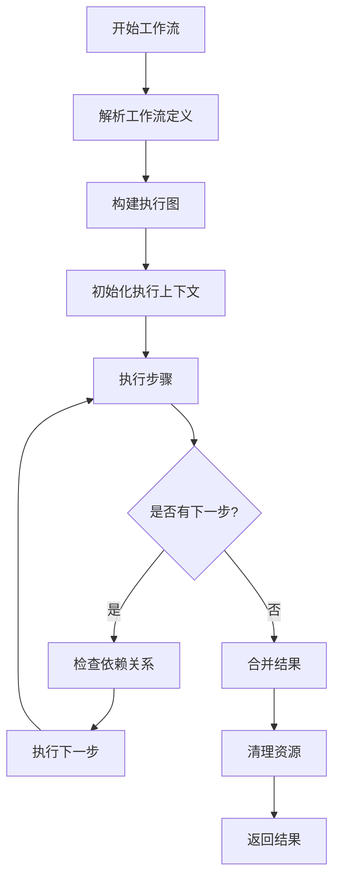
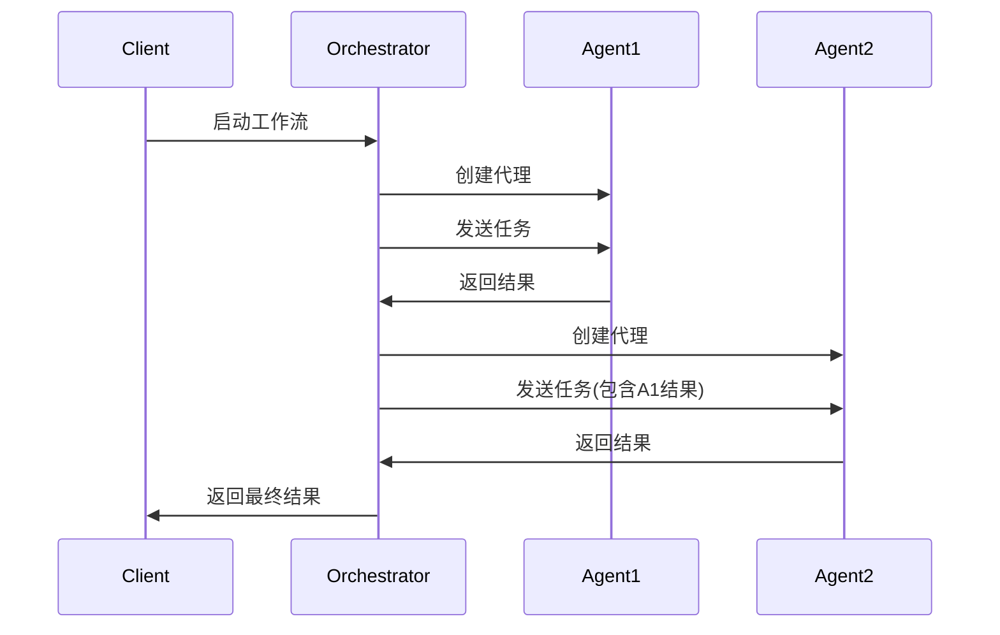
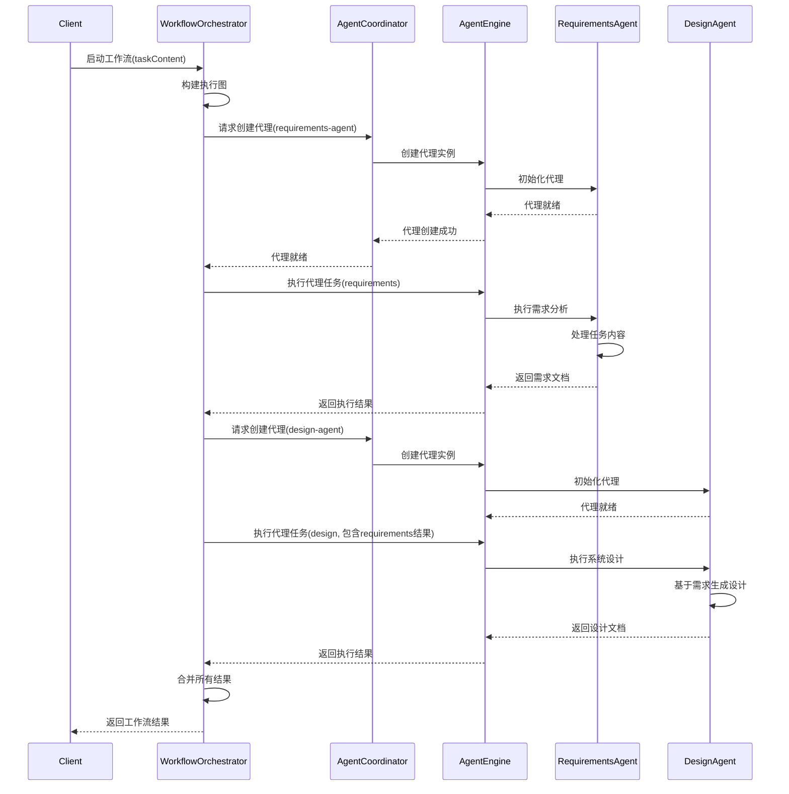
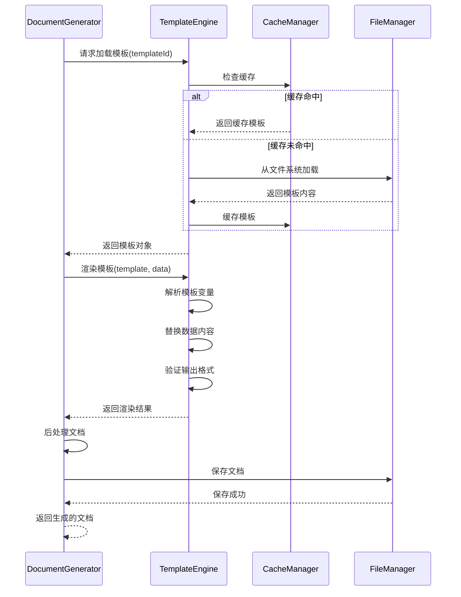

# CMMI Specs Agent 项目重构系统设计文档

<!-- CMMI: TS -->

## 1. 总体架构

### 1.1 架构概览

基于需求分析，新的CMMI Specs Agent采用分层模块化架构，确保高内聚、低耦合：

```
┌─────────────────────────────────────────────────────────────┐
│                      表示层 (Presentation Layer)             │
├─────────────────────────────────────────────────────────────┤
│                VS Code Extension Interface                   │
│                MCP Protocol Handler                          │
└─────────────────────────────────────────────────────────────┘
                                 │
┌─────────────────────────────────────────────────────────────┐
│                      应用层 (Application Layer)              │
├─────────────────────────────────────────────────────────────┤
│  ┌─────────────┐ ┌─────────────┐ ┌─────────────┐            │
│  │   Workflow  │ │   Agent     │ │   Tool      │            │
│  │ Orchestrator│ │ Coordinator │ │  Registry   │            │
│  └─────────────┘ └─────────────┘ └─────────────┘            │
└─────────────────────────────────────────────────────────────┘
                                 │
┌─────────────────────────────────────────────────────────────┐
│                      核心层 (Core Layer)                     │
├─────────────────────────────────────────────────────────────┤
│  ┌─────────────┐ ┌─────────────┐ ┌─────────────┐            │
│  │    Agent    │ │  Document   │ │  Template   │            │
│  │   Engine    │ │  Generator  │ │   Engine    │            │
│  └─────────────┘ └─────────────┘ └─────────────┘            │
│  ┌─────────────┐ ┌─────────────┐ ┌─────────────┐            │
│  │ Performance │ │    Cache    │ │    I18n     │            │
│  │  Monitor    │ │   Manager   │ │   Manager   │            │
│  └─────────────┘ └─────────────┘ └─────────────┘            │
└─────────────────────────────────────────────────────────────┘
                                 │
┌─────────────────────────────────────────────────────────────┐
│                      基础层 (Infrastructure Layer)           │
├─────────────────────────────────────────────────────────────┤
│  ┌─────────────┐ ┌─────────────┐ ┌─────────────┐            │
│  │   Config    │ │   Logger    │ │    Error    │            │
│  │  Manager    │ │   System    │ │   Handler   │            │
│  └─────────────┘ └─────────────┘ └─────────────┘            │
│  ┌─────────────┐ ┌─────────────┐ ┌─────────────┐            │
│  │    File     │ │   Network   │ │   Security  │            │
│  │   System    │ │   Client    │ │   Manager   │            │
│  └─────────────┘ └─────────────┘ └─────────────┘            │
└─────────────────────────────────────────────────────────────┘
```

### 1.2 设计原则

**模块化设计原则**:
- **单一职责**: 每个模块只负责一个特定功能
- **接口隔离**: 模块间通过清晰的接口通信
- **依赖倒置**: 高层模块不依赖底层模块
- **开放封闭**: 对扩展开放，对修改封闭

**性能设计原则**:
- **异步优先**: 所有I/O操作异步执行
- **缓存策略**: 合理使用缓存减少重复计算
- **资源池化**: 复用资源避免频繁创建销毁
- **渐进加载**: 按需加载模块和资源

## 2. 模块划分与接口说明

### 2.1 表示层模块

#### MCP Protocol Handler (D-1.1)
**职责**: 处理MCP协议通信，管理工具调用
```typescript
interface MCPProtocolHandler {
  // 初始化MCP连接
  initialize(transport: Transport): Promise<void>;
  
  // 注册工具处理器
  registerTool(tool: MCPTool): void;
  
  // 处理工具调用请求
  handleToolCall(request: ToolCallRequest): Promise<ToolCallResponse>;
  
  // 发送通知
  sendNotification(notification: Notification): void;
}
```

#### VS Code Extension Interface (D-1.2)
**职责**: VS Code扩展集成，用户交互界面
```typescript
interface VSCodeInterface {
  // 注册命令
  registerCommand(command: string, handler: CommandHandler): void;
  
  // 显示进度
  showProgress(title: string, task: ProgressTask): Promise<void>;
  
  // 显示通知
  showNotification(type: NotificationType, message: string): void;
}
```

### 2.2 应用层模块

#### Workflow Orchestrator (D-1.3)
**职责**: 工作流编排，协调多代理协作
```typescript
interface WorkflowOrchestrator {
  // 执行工作流
  executeWorkflow(definition: WorkflowDefinition): Promise<WorkflowResult>;
  
  // 监控工作流状态
  monitorWorkflow(workflowId: string): AsyncIterable<WorkflowStatus>;
  
  // 取消工作流
  cancelWorkflow(workflowId: string): Promise<void>;
}

interface WorkflowDefinition {
  id: string;
  steps: WorkflowStep[];
  executionMode: 'sequential' | 'parallel' | 'smart';
  timeout: number;
}
```

#### Agent Coordinator (D-1.4)
**职责**: 代理生命周期管理，状态监控
```typescript
interface AgentCoordinator {
  // 创建代理实例
  createAgent(config: AgentConfig): Promise<Agent>;
  
  // 获取代理状态
  getAgentStatus(agentId: string): AgentStatus;
  
  // 代理通信
  sendMessage(agentId: string, message: AgentMessage): Promise<AgentResponse>;
  
  // 销毁代理
  destroyAgent(agentId: string): Promise<void>;
}
```

#### Tool Registry (D-1.5)
**职责**: 工具注册管理，动态加载
```typescript
interface ToolRegistry {
  // 注册工具
  register(tool: Tool): void;
  
  // 获取工具
  getTool(name: string): Tool | undefined;
  
  // 获取所有工具
  getAllTools(): Tool[];
  
  // 工具版本管理
  getToolVersion(name: string): string;
}
```

### 2.3 核心层模块

#### Agent Engine (D-2.1)
**职责**: 代理执行引擎，处理代理逻辑
```typescript
interface AgentEngine {
  // 执行代理任务
  execute(agent: Agent, context: ExecutionContext): Promise<AgentResult>;
  
  // 代理状态管理
  updateState(agentId: string, state: AgentState): void;
  
  // 代理间通信
  sendToAgent(fromId: string, toId: string, message: any): Promise<any>;
}

interface Agent {
  id: string;
  name: string;
  capabilities: string[];
  model: string;
  systemPrompt: string;
  tools: string[];
}
```

#### Document Generator (D-2.2)
**职责**: 文档生成核心逻辑，模板渲染
```typescript
interface DocumentGenerator {
  // 生成文档
  generate(template: Template, data: any): Promise<Document>;
  
  // 合并文档
  merge(documents: Document[]): Promise<Document>;
  
  // 验证文档
  validate(document: Document): ValidationResult;
}

interface Template {
  id: string;
  name: string;
  version: string;
  content: string;
  variables: TemplateVariable[];
}
```

#### Template Engine (D-2.3)
**职责**: 模板管理，动态模板生成
```typescript
interface TemplateEngine {
  // 加载模板
  loadTemplate(templateId: string): Promise<Template>;
  
  // 渲染模板
  render(template: Template, context: RenderContext): Promise<string>;
  
  // 缓存模板
  cacheTemplate(template: Template): void;
  
  // 模板版本控制
  getTemplateVersions(templateId: string): string[];
}
```

### 2.4 基础层模块

#### Config Manager (D-3.1)
**职责**: 配置管理，环境配置
```typescript
interface ConfigManager {
  // 加载配置
  load(configPath: string): Promise<Config>;
  
  // 获取配置值
  get<T>(key: string): T;
  
  // 设置配置值
  set(key: string, value: any): void;
  
  // 监听配置变化
  watch(key: string, callback: ConfigChangeCallback): void;
}
```

#### Performance Monitor (D-3.2)
**职责**: 性能监控，资源统计
```typescript
interface PerformanceMonitor {
  // 开始性能监控
  startMonitoring(operation: string): PerformanceTracker;
  
  // 记录指标
  recordMetric(name: string, value: number, tags?: Tags): void;
  
  // 获取性能报告
  getReport(timeRange: TimeRange): PerformanceReport;
}
```

## 3. 数据结构与流程设计

### 3.1 核心数据结构

#### Agent Configuration
```typescript
interface AgentConfig {
  name: string;
  title: string;
  description: string;
  model: string;
  language: string;
  capabilities: string[];
  dependencies: string[];
  entrypoints: EntryPoint[];
  instructions: string;
}
```

#### Workflow Execution Context
```typescript
interface ExecutionContext {
  workflowId: string;
  stepId: string;
  input: any;
  sharedContext: Map<string, any>;
  metadata: ExecutionMetadata;
}
```

#### Performance Metrics
```typescript
interface PerformanceMetrics {
  responseTime: number;
  memoryUsage: number;
  cpuUsage: number;
  throughput: number;
  errorRate: number;
  timestamp: Date;
}
```

### 3.2 关键算法流程

#### 工作流执行算法 (D-4.1)


#### 代理通信协议 (D-4.2)


#### 缓存管理策略 (D-4.3)
- **L1缓存**: 内存缓存，存储频繁访问的模板和配置
- **L2缓存**: 磁盘缓存，存储编译后的模板和中间结果
- **缓存失效**: 基于TTL和版本号的缓存失效策略
- **缓存预热**: 系统启动时预加载常用资源

## 4. 与需求的映射关系

### 4.1 架构需求映射

| 需求ID | 设计组件 | 实现方式 |
|--------|----------|----------|
| FR-1.1 | 分层架构设计 | 四层架构，模块化设计 |
| FR-1.2 | Tool Registry | 动态工具注册机制 |
| FR-1.3 | Agent Coordinator | 代理生命周期管理 |

### 4.2 性能需求映射

| 需求ID | 设计策略 | 技术方案 |
|--------|----------|----------|
| FR-3.1 | 异步处理架构 | Promise/async-await模式 |
| FR-3.2 | 缓存分层设计 | 内存+磁盘缓存 |
| FR-3.3 | 并发控制机制 | 工作队列+资源池 |

### 4.3 质量需求映射

| 需求ID | 设计保证 | 实现机制 |
|--------|----------|----------|
| FR-2.1 | 可测试性设计 | 依赖注入+接口抽象 |
| FR-2.2 | 监控和日志 | 统一日志框架 |
| FR-2.3 | 错误处理机制 | 统一异常处理 |

## 5. 实现注意事项与边界条件

### 5.1 技术实现要点

**模块加载策略**:
- 使用动态import实现按需加载
- 模块间通过依赖注入减少耦合
- 支持模块热重载用于开发调试

**异步处理优化**:
- 所有I/O操作使用async/await
- 合理使用Promise.all并行处理
- 实现超时控制避免资源泄露

**内存管理**:
- 及时释放不再使用的对象
- 使用WeakMap避免内存泄露
- 定期执行垃圾回收

### 5.2 边界条件处理

**输入验证**:
- 所有外部输入严格验证类型和格式
- 参数范围检查和默认值设置
- 恶意输入过滤和防护

**资源限制**:
- 内存使用上限控制
- 并发请求数量限制
- 文件操作权限检查

**错误处理**:
- 分级错误处理机制
- 错误上下文保存和传递
- 优雅的错误恢复策略

### 5.3 扩展性考虑

**插件架构**:
- 标准化的插件接口定义
- 插件生命周期管理
- 插件间依赖解析

**配置热更新**:
- 配置文件监听机制
- 无中断配置更新
- 配置版本管理

**多版本兼容**:
- API版本控制
- 向后兼容性保证
- 平滑升级机制

## 6. 实现清单

### 6.1 核心模块实现清单

**基础设施层** (优先级: 高):
- [ ] ConfigManager - 配置管理系统
- [ ] Logger - 统一日志系统  
- [ ] ErrorHandler - 错误处理机制
- [ ] PerformanceMonitor - 性能监控

**核心层** (优先级: 高):
- [ ] AgentEngine - 代理执行引擎
- [ ] DocumentGenerator - 文档生成器
- [ ] TemplateEngine - 模板引擎
- [ ] CacheManager - 缓存管理器

**应用层** (优先级: 中):
- [ ] WorkflowOrchestrator - 工作流编排器
- [ ] AgentCoordinator - 代理协调器
- [ ] ToolRegistry - 工具注册中心

**表示层** (优先级: 中):
- [ ] MCPProtocolHandler - MCP协议处理器
- [ ] VSCodeInterface - VS Code接口

### 6.2 文件结构规划

```
mcp-server/
├── src/
│   ├── core/                 # 核心层
│   │   ├── agent/           # 代理引擎
│   │   ├── document/        # 文档生成
│   │   ├── template/        # 模板引擎
│   │   └── cache/           # 缓存管理
│   ├── application/         # 应用层
│   │   ├── workflow/        # 工作流编排
│   │   ├── coordinator/     # 代理协调
│   │   └── registry/        # 工具注册
│   ├── infrastructure/      # 基础层
│   │   ├── config/          # 配置管理
│   │   ├── logger/          # 日志系统
│   │   ├── error/           # 错误处理
│   │   └── monitor/         # 性能监控
│   ├── presentation/        # 表示层
│   │   ├── mcp/             # MCP协议
│   │   └── vscode/          # VS Code接口
│   └── types/               # 类型定义
├── tests/                   # 测试文件
├── docs/                    # 设计文档
└── config/                  # 配置文件
```

## 7. 详细组件设计

### 7.1 核心组件类图设计

#### Agent Engine 核心类设计
```typescript
class AgentEngine {
  private agents: Map<string, Agent>;
  private executionQueue: ExecutionQueue;
  private stateManager: StateManager;

  async execute(agent: Agent, context: ExecutionContext): Promise<AgentResult> {
    const tracker = this.performanceMonitor.startMonitoring(`agent.${agent.name}`);
    try {
      // 1. 验证代理状态
      await this.validateAgent(agent);
      
      // 2. 准备执行上下文
      const enrichedContext = await this.enrichContext(context);
      
      // 3. 执行代理逻辑
      const result = await this.executeAgent(agent, enrichedContext);
      
      // 4. 更新状态
      await this.updateAgentState(agent.id, AgentState.COMPLETED);
      
      return result;
    } catch (error) {
      await this.handleExecutionError(agent.id, error);
      throw error;
    } finally {
      tracker.end();
    }
  }

  private async executeAgent(agent: Agent, context: ExecutionContext): Promise<AgentResult> {
    // 代理执行核心逻辑
    const prompt = await this.buildPrompt(agent, context);
    const modelResponse = await this.callModel(agent.model, prompt);
    return this.parseAgentResult(modelResponse);
  }
}
```

#### Workflow Orchestrator 详细设计
```typescript
class WorkflowOrchestrator {
  private workflowGraph: WorkflowGraph;
  private executionEngine: ExecutionEngine;
  private contextManager: ContextManager;

  async executeWorkflow(definition: WorkflowDefinition): Promise<WorkflowResult> {
    const workflowId = this.generateWorkflowId();
    
    try {
      // 1. 构建执行图
      const graph = await this.buildExecutionGraph(definition);
      
      // 2. 初始化上下文
      const context = this.createExecutionContext(workflowId, definition);
      
      // 3. 执行工作流
      const result = await this.executeGraph(graph, context);
      
      // 4. 合并结果
      return this.consolidateResults(result);
      
    } catch (error) {
      await this.handleWorkflowError(workflowId, error);
      throw error;
    }
  }

  private async executeGraph(graph: WorkflowGraph, context: ExecutionContext): Promise<any> {
    const results = new Map();
    const visited = new Set();
    
    // 拓扑排序执行
    const sortedNodes = this.topologicalSort(graph);
    
    for (const node of sortedNodes) {
      if (!this.canExecuteNode(node, visited)) {
        continue;
      }
      
      const nodeResult = await this.executeNode(node, context, results);
      results.set(node.id, nodeResult);
      visited.add(node.id);
      
      // 更新共享上下文
      context.sharedContext.set(node.id, nodeResult);
    }
    
    return results;
  }
}
```

### 7.2 关键组件时序图

#### 多代理协作时序图


#### 文档生成流程时序图


### 7.3 状态管理设计

#### Agent 状态机
```typescript
enum AgentState {
  IDLE = 'idle',
  INITIALIZING = 'initializing',
  READY = 'ready',
  EXECUTING = 'executing',
  COMPLETED = 'completed',
  ERROR = 'error',
  DESTROYED = 'destroyed'
}

interface AgentStateTransition {
  from: AgentState;
  to: AgentState;
  condition?: (agent: Agent) => boolean;
  action?: (agent: Agent) => Promise<void>;
}

class AgentStateManager {
  private transitions: Map<string, AgentStateTransition[]>;
  
  constructor() {
    this.defineTransitions();
  }

  private defineTransitions() {
    this.transitions.set('idle->initializing', [{
      from: AgentState.IDLE,
      to: AgentState.INITIALIZING,
      action: async (agent) => await this.initializeAgent(agent)
    }]);
    
    this.transitions.set('initializing->ready', [{
      from: AgentState.INITIALIZING,
      to: AgentState.READY,
      condition: (agent) => agent.isInitialized
    }]);
    
    // ... 更多状态转换定义
  }
}
```

#### Workflow 状态管理
```typescript
interface WorkflowState {
  id: string;
  status: WorkflowStatus;
  currentStep: string;
  completedSteps: string[];
  context: ExecutionContext;
  startTime: Date;
  endTime?: Date;
  error?: Error;
}

class WorkflowStateManager {
  private states: Map<string, WorkflowState>;
  private listeners: Map<string, StateChangeListener[]>;

  updateState(workflowId: string, updates: Partial<WorkflowState>): void {
    const currentState = this.states.get(workflowId);
    if (!currentState) {
      throw new Error(`Workflow ${workflowId} not found`);
    }

    const newState = { ...currentState, ...updates };
    this.states.set(workflowId, newState);
    
    // 触发状态变化监听器
    this.notifyListeners(workflowId, currentState, newState);
  }
}
```

### 7.4 错误处理和恢复机制

#### 分层错误处理
```typescript
abstract class BaseError extends Error {
  abstract readonly category: ErrorCategory;
  abstract readonly severity: ErrorSeverity;
  readonly timestamp: Date = new Date();
  readonly context: Record<string, any> = {};
}

class AgentExecutionError extends BaseError {
  readonly category = ErrorCategory.AGENT;
  readonly severity = ErrorSeverity.HIGH;
  
  constructor(
    message: string,
    public readonly agentId: string,
    public readonly originalError?: Error
  ) {
    super(message);
    this.context = { agentId, originalError };
  }
}

class ErrorHandler {
  private recoveryStrategies: Map<string, RecoveryStrategy>;

  async handleError(error: BaseError): Promise<ErrorHandlingResult> {
    // 1. 记录错误
    this.logger.error('Error occurred', {
      category: error.category,
      severity: error.severity,
      message: error.message,
      context: error.context
    });

    // 2. 选择恢复策略
    const strategy = this.selectRecoveryStrategy(error);
    
    // 3. 执行恢复
    if (strategy) {
      return await strategy.recover(error);
    }

    // 4. 无法恢复，重新抛出
    throw error;
  }
}
```

### 7.5 性能优化设计

#### 缓存层次结构
```typescript
interface CacheLayer {
  get<T>(key: string): Promise<T | undefined>;
  set<T>(key: string, value: T, ttl?: number): Promise<void>;
  delete(key: string): Promise<void>;
  clear(): Promise<void>;
}

class L1MemoryCache implements CacheLayer {
  private cache: Map<string, CacheEntry>;
  private maxSize: number = 1000;

  async get<T>(key: string): Promise<T | undefined> {
    const entry = this.cache.get(key);
    if (!entry || this.isExpired(entry)) {
      this.cache.delete(key);
      return undefined;
    }
    
    // 更新访问时间用于LRU
    entry.lastAccessed = Date.now();
    return entry.value as T;
  }
}

class L2FileCache implements CacheLayer {
  constructor(private cacheDir: string) {}

  async get<T>(key: string): Promise<T | undefined> {
    const filePath = this.getCacheFilePath(key);
    try {
      const content = await fs.readFile(filePath, 'utf-8');
      const entry: CacheEntry = JSON.parse(content);
      
      if (this.isExpired(entry)) {
        await fs.unlink(filePath);
        return undefined;
      }
      
      return entry.value as T;
    } catch (error) {
      return undefined;
    }
  }
}

class CacheManager {
  constructor(
    private l1Cache: L1MemoryCache,
    private l2Cache: L2FileCache
  ) {}

  async get<T>(key: string): Promise<T | undefined> {
    // 先查L1缓存
    let value = await this.l1Cache.get<T>(key);
    if (value !== undefined) {
      return value;
    }

    // 再查L2缓存
    value = await this.l2Cache.get<T>(key);
    if (value !== undefined) {
      // 回写到L1缓存
      await this.l1Cache.set(key, value);
      return value;
    }

    return undefined;
  }
}
```

#### 资源池管理
```typescript
class ResourcePool<T> {
  private available: T[] = [];
  private inUse: Set<T> = new Set();
  private maxSize: number;
  private createResource: () => Promise<T>;
  private destroyResource: (resource: T) => Promise<void>;

  async acquire(): Promise<T> {
    // 如果有可用资源，直接返回
    if (this.available.length > 0) {
      const resource = this.available.pop()!;
      this.inUse.add(resource);
      return resource;
    }

    // 如果未达到最大容量，创建新资源
    if (this.inUse.size < this.maxSize) {
      const resource = await this.createResource();
      this.inUse.add(resource);
      return resource;
    }

    // 等待资源释放
    return new Promise((resolve) => {
      this.waitingQueue.push(resolve);
    });
  }

  async release(resource: T): Promise<void> {
    if (!this.inUse.has(resource)) {
      throw new Error('Resource not in use');
    }

    this.inUse.delete(resource);
    
    // 如果有等待者，直接给等待者
    if (this.waitingQueue.length > 0) {
      const waiter = this.waitingQueue.shift()!;
      this.inUse.add(resource);
      waiter(resource);
      return;
    }

    // 否则放回可用池
    this.available.push(resource);
  }
}
```

---

*文档版本: v1.1*  
*创建时间: 2025-08-12*  
*更新时间: 2025-08-12*  
*创建者: design-agent*  
*基于需求: requirements.md v1.0*  
*审核状态: 待审核*
